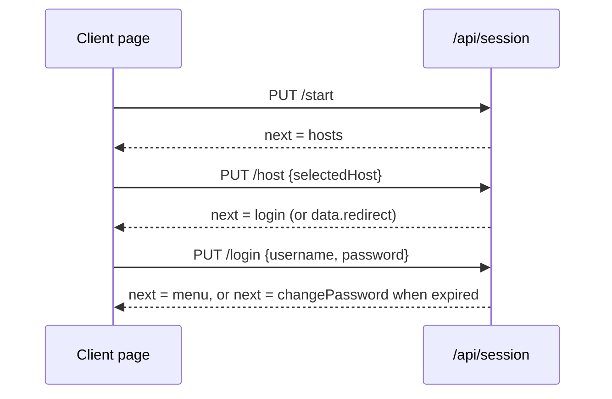

# Commander4j Web REST API

As of 2026-09-21 · Dave Garratt

Living copy: https://claude.ai/code/artifact/adb93638-ceff-4582-9405-0d5269099baa

## Overview

The API is the JSON back end of the c4j_commander4j_web mobile client: 16 servlets under `/api/*`, one per screen group, called by the static HTML/JS pages that run on the MC9400 scanner's Chrome. It is not a general integration API. Every call assumes a browser session (Tomcat cookie), the RF-menu permission model of the desktop, and the page flow the client follows (hosts, login, menu, transaction screens).

- **Base URL**: `http://<tomcat>:<port>/c4j_commander4j_web/api/...` (the war's context path plus `/api`).
- **Registration**: each servlet carries an `@WebServlet` annotation; web.xml registers only the two listeners and the CanonicalUrl and NoCache filters.
- **Runtime**: Jakarta Servlet 6 on Tomcat, Gson for JSON, the shared commander4j.jar for all database access. HTTP session timeout is 60 minutes.
- **Source**: `src/main/java/com/commander4j/web/api/`, with `JsonServlet` as the base class of every endpoint and `ApiResponse` as the single reply shape.

## Conventions

Every endpoint returns HTTP 200 with one JSON envelope. Success or failure is in the body, not the status code, so a client checks `ok` and `next` rather than the HTTP status.

```json
{ "ok": true, "message": "", "next": "", "data": null }
```

| Field | Type | Meaning |
| --- | --- | --- |
| ok | boolean | true when the request did what was asked; false carries the reason in message |
| message | string | text for the page's yellow status label; blank when there is nothing to say |
| next | string | page the client must show next (a page name such as `menu`, `login`, `palletInfoDisplay`); blank = stay on the current page |
| data | object or null | endpoint-specific payload; nulls are serialised, never omitted |

**Verbs.** GET reads state, PUT performs an action (the servlets treat PUT as the form Submit of the old JSP page), DELETE ends the session. A verb the servlet does not handle answers `ok:false` with a "Method not supported" or "Unknown ... action" message.

**Request body.** JSON object, sent with `Content-Type: application/json`. A body with any other content type, an empty body, or malformed JSON is treated as an empty object, so missing fields read as blank strings and are never an error in themselves. Query-string parameters are used by one endpoint only (`GET /api/lang?keys=`).

**Paths.** The part after the servlet mapping selects the action, for example `/api/pallets/confirm`. Path parameters are not used; identifiers such as the SSCC always travel in the body.

**Caching.** Every reply carries `Cache-Control: no-store`, `Pragma: no-cache` and `Expires: 0`, while the NoCacheFilter makes static pages revalidate on every load (no-cache) and serves content-hashed assets with a one-year cache.

**Concurrency.** Each request runs under a per-session lock, so one scanner cannot double-submit, while different devices run in parallel. Host connects are additionally serialised across the JVM.

**SSCC input.** Endpoints that take an `sscc` accept an 18-digit SSCC, a 20-character `00`+SSCC scan, or a full GS1-128 scan (parsed by the session's barcode parser). The reply always carries the normalised 18-digit form.

**Language.** Text for the pages is not embedded in the API. The client asks `GET /api/lang` for the SYS_LANGUAGE keys it needs in the logged-on user's language and keeps its own English fallback when a key is blank.

## Authentication and session

There is no token. The client holds a Tomcat session cookie (JSESSIONID), and the server keeps the selected host, the logged-on user and every screen's working values as session attributes. The user id written to the database is always taken from the server-side user list, never from the request body, and the password is not stored in the session.

**Guards.** Before any handler runs, the base servlet applies three checks in order. Each failure answers `{ "ok": false, "message": "", "next": "sessionTimeout" }`. The blank message is deliberate: the client keys on `next` and shows the session-timeout page.

1. The session is brand new (cookie missing or expired).
2. No host has been selected.
3. No user is logged on.

| Endpoint group | Needs host | Needs login | Module gate |
| --- | --- | --- | --- |
| /api/ping | no | no | none |
| /api/hosts, /api/session | no | no | none |
| /api/lang, /api/menu | yes | yes | none |
| every other servlet | yes | yes | one SYS_MODULES id per servlet, or per path |

**Module gate.** A gated endpoint is refused unless the module is in the user's loaded permission list (the same list the desktop and RF menu use). The refusal is `{ "ok": false, "message": "Not authorised", "next": "menu" }`. Servlets that serve several modules check per path instead, for example the pallet servlet checks FRM_PAL_PROD_CONFIRM on confirm but FRM_PAL_DELETE on delete. Two paths, `confirmPlus/reset` and `confirmPlus/cancel`, only clear session values and are not gated. Hiding a button on the client is not treated as security.

**Sign-on flow.**



Selecting a host drops any previous connection and user, then connects the session to that host's database. When hosts.xml points a site at another web server (driver `http`), the reply carries `data.redirect` with that URL instead of a next page. A login that fails leaves the session on the login page with the reason in `message`. An expired or must-change password logs the user on but answers ok:false with the message "Password expired." and next set to the change-password page; cancelling there logs the user off again.

**Sign-off.** `DELETE /api/session` drops both user and host and returns to the hosts page. `PUT /api/menu/exit` (the Yes on the logout confirmation) drops only the user and returns to login with the host still connected.

**Timeout.** The HTTP session expires after 60 minutes idle. The session listener releases the database connection, the user entry and the per-session lock when Tomcat destroys the session.

## Endpoint reference

One table per servlet, in the order the client meets them. The Body column lists the JSON fields the endpoint reads; the Data column lists what `data` carries on success. Data values are strings unless marked: booleans are `selected`, `hasHost`, `loggedOn`, `isRoot`, `isNew`; integers are `hosts` on ping and `page`, `maxPages` on the despatch list. A next of "blank" means the client stays on its page.

### Session

Path `/api/session`. No host or login required.

| Method | Path | Body | Data | next | Notes |
| --- | --- | --- | --- | --- | --- |
| GET | /api/session | none | hasHost, selectedHost, siteDescription, loggedOn, username, language | blank | current state, called by every page on load |
| PUT | /api/session/start | none | none | hosts | clears the selected host (index Start, timeout Restart) |
| PUT | /api/session/host | selectedHost | redirect (only for a site with driver `http`) | login, or hosts on a connect failure | drops any previous connection and user, then connects |
| PUT | /api/session/login | username, password | none | menu; an expired or must-change password answers ok:false, message "Password expired.", next changePassword | ok:false with the reason in message on a bad login |
| PUT | /api/session/password | password, newPassword1, newPassword2 | none | menu | current password is checked here; message "Password changed" |
| PUT | /api/session/password | cancel: true | none | login when the expired-password flow is abandoned, else menu | |
| DELETE | /api/session | none | none | hosts | logs off and disconnects the host |

### Ping

| Method | Path | Body | Data | next | Notes |
| --- | --- | --- | --- | --- | --- |
| GET | /api/ping | none | version, schema, server, hosts, hasHost, loggedOn | blank | no host or login needed; backs the welcome page |

### Hosts

| Method | Path | Body | Data | next | Notes |
| --- | --- | --- | --- | --- | --- |
| GET | /api/hosts | none | hosts[] {siteNumber, description, selected}, selected | blank | enabled sites from hosts.xml; selected is the session's host, else the first enabled one |

### Language

| Method | Path | Body | Data | next | Notes |
| --- | --- | --- | --- | --- | --- |
| GET | /api/lang?keys=a,b,c | query string only | language, text {key: value} | blank | needs a login; a key with no row in the user's language comes back blank |

### Menu

Path `/api/menu`. Needs a login. The chosen module is permission-checked on select.

| Method | Path | Body | Data | next | Notes |
| --- | --- | --- | --- | --- | --- |
| GET | /api/menu | none | options[] {moduleID, description, icon, moduleType, selected}, selected, menu, title, isRoot | blank | one level of the nested RF menu; sub-menus with nothing the user may run are left out |
| PUT | /api/menu/select | selectedMenuOption | none | menu for a MENU row, else the module's page | blank option = ok and stay; "Not authorised"; "Screen '...' not ported yet" |
| PUT | /api/menu/back | none | none | menu one level up, or logoutConfirm at the top | the menu just left is re-selected |
| PUT | /api/menu/exit | none | none | login | drops the user, host stays connected |

Module to page map used by select:

| Module | Page |
| --- | --- |
| FRM_PAL_PROD_CONFIRM | productionConfirm |
| FRM_PAL_PROD_CONFIRM+ | productionConfirmPlusSSCC |
| FRM_PAL_DELETE | palletDelete |
| FRM_PAL_INFO | palletInfo |
| FRM_BARCODE_VALIDATE | validateDUSelect |
| FRM_ADMIN_DESPATCH | despatchSelect |
| FRM_ADMIN_WASTE_LOG | wasteLog |
| FRM_CM_PRINTERS | printerSelect |
| FRM_USER_PASS_CHANGE | changePassword |
| SYS_INFO | sysInfo |
| FRM_PAL_ISSUE | processOrderIssueSelect |
| FRM_PAL_RETURN | palletReturnSelect |
| FRM_ADMIN_PALLET_HISTORY | palletHistory |
| FRM_QM_PANEL_SCORES | qmScoreUser |
| FRM_QM_PANEL_SETUP | qmPanels |
| FRM_QM_PANEL_ADMIN | qmUsers |

### Printers

Module FRM_CM_PRINTERS.

| Method | Path | Body | Data | next | Notes |
| --- | --- | --- | --- | --- | --- |
| GET | /api/printers | none | printers[] (queue names), selected | blank | queues seen by the Tomcat JVM |
| PUT | /api/printers | selectedPrintQueue | none | menu | stored as the session's default printer |

### Pallets

Path `/api/pallets`. Module checked per path, shown in Notes. Every pallet page reads its values from the state endpoint on load.

| Method | Path | Body | Data | next | Notes |
| --- | --- | --- | --- | --- | --- |
| GET | /api/pallets/state | none | confirmCount, deleteCount, validateOrder, material, materialDescription, materialDU_EAN, materialDU_VARIANT, palletGTIN, palletVariant, trayGTIN, trayVariant, palletGTINColor, palletVariantColor, trayGTINColor, trayVariantColor, validateSSCC, resultImage, resultMessage, sscc, processOrder, location, despatchNo, batch, palletStatus, batchStatus, quantity, uom, dom, expiry, description, lotNumber | blank | not gated; every value is the session's current string |
| PUT | /api/pallets/confirm | sscc | confirmCount | blank | FRM_PAL_PROD_CONFIRM; always ok, outcome in message: "SSCC n confirmed.", "SSCC not found." or the pallet error |
| PUT | /api/pallets/confirmPlus/sscc | sscc | none | productionConfirmPlusDU | FRM_PAL_PROD_CONFIRM+; fails on "SSCC not found." or "Pallet already confirmed." |
| PUT | /api/pallets/confirmPlus/du | trayDU | none | productionConfirmPlusSSCC on success; productionConfirmPlusError with ok:false when barcodes disagree | FRM_PAL_PROD_CONFIRM+; tray scan must carry AI 01; the colour values in state say which field disagreed |
| PUT | /api/pallets/confirmPlus/reset | none | none | productionConfirmPlusSSCC | clears sscc; not gated |
| PUT | /api/pallets/confirmPlus/cancel | none | none | menu | clears validateOrder and sscc; not gated |
| PUT | /api/pallets/delete | sscc | deleteCount | blank | FRM_PAL_DELETE; always ok, outcome in message |
| PUT | /api/pallets/info | sscc | none | palletInfoDisplay | FRM_PAL_INFO; fails on "SSCC not found." or "SSCC not confirmed."; the display page reads state |

### Barcode validation

Module FRM_BARCODE_VALIDATE. Page values come from the pallets state endpoint.

| Method | Path | Body | Data | next | Notes |
| --- | --- | --- | --- | --- | --- |
| PUT | /api/validate/select | validateOrder, validateSSCC | none | validateDUPallet | an SSCC, when given, supplies the order; both blank = ok and stay; unknown order = ok:false |
| PUT | /api/validate/pallet | palletDU | none | validateDUTray | scan must carry AI 02 |
| PUT | /api/validate/tray | trayDU | none | validateDUResult | scan must carry AI 01; message "Barcodes consistent" or "Barcodes inconsistent" |
| PUT | /api/validate/cancel | to: "menu" or "select" | none | menu or validateDUSelect | clears order and SSCC |

### Despatch

Module FRM_ADMIN_DESPATCH. The despatch number and list page live in the session.

| Method | Path | Body | Data | next | Notes |
| --- | --- | --- | --- | --- | --- |
| GET | /api/despatch/list | none | page, maxPages, despatches[] {despatchNo, trailer, selected} | blank | unconfirmed despatches; page size from the DESPATCH_LIST_SIZE control (default 8) |
| PUT | /api/despatch/page | dir: "prev" or "next" | same as list | blank | |
| PUT | /api/despatch/create | none | none | despatchHeader | generates the number and assigns it to the user |
| PUT | /api/despatch/amend | despatchNo | none | despatchHeader | ok:false "Despatch is assigned to X" for another user's despatch |
| PUT | /api/despatch/exit | none | none | menu | |
| GET | /api/despatch/header | none | locations[], despatchNo, despatchFromLocation, despatchToLocation, despatchTrailer, despatchHaulier, despatchLoadNo, despatchJourneyRef, despatchPalletCount | blank | |
| PUT | /api/despatch/header | action: "addPallets", "confirm", "print" or "exit"; despatchFromLocation, despatchToLocation, despatchTrailer, despatchHaulier, despatchLoadNo, despatchJourneyRef | none | despatchPallet, despatchConfirm, blank, despatchSelect | saves the header first (only while Unconfirmed); addPallets needs both locations |
| PUT | /api/despatch/pallets | sscc, addRemoveMode ("remove", anything else adds) | despatchPalletCount | blank | always ok, outcome in message |
| PUT | /api/despatch/pallets/cancel | none | none | despatchHeader, or despatchSelect when the despatch no longer loads | |
| PUT | /api/despatch/confirm | yes (boolean), printSTNonConfirm (boolean) | none | despatchSelect on Yes; despatchHeader on No or on a confirm failure | print queues an RPT_DESPATCH_SERVICE report request to the session's default printer |

### Waste log

Module FRM_ADMIN_WASTE_LOG. Request fields end in Combo, reply fields end in ID.

| Method | Path | Body | Data | next | Notes |
| --- | --- | --- | --- | --- | --- |
| GET | /api/waste | none | transactions[], locations[], containers[], materials[], reasons[], wasteTransactionID, wasteLocationID, wasteContainerID, wasteMaterialID, wasteReasonID, wasteProcessOrder, wasteQuantity, wasteMaterialUOM | blank | materials list depends on the current location |
| PUT | /api/waste | wasteTransactionCombo, wasteLocationCombo, wasteContainerCombo, wasteMaterialCombo, wasteReasonCombo, wasteProcessOrder, wasteQuantity, wasteBarcode | same as GET | blank | wasteBarcode present: parse AIs 91 to 95 and 00 into the values (a combo choice is sent as "<AI><value>"); wasteBarcode blank: write the log, message "Log <ref> created." |
| PUT | /api/waste/cancel | none | none | menu | clears the last-used values |

### Pallet issue

Module FRM_PAL_ISSUE. Flow: orders, then BOM stage and SSCC, then confirm. Selecting the module from the menu clears the whole flow.

| Method | Path | Body | Data | next | Notes |
| --- | --- | --- | --- | --- | --- |
| GET | /api/issue/orders | none | resources[] {resource, description}, selectedResource, orders[] {processOrder, material, description, selected}, selectedProcessOrder, username | blank | Ready orders, filtered by resource when one is selected |
| PUT | /api/issue/resource | resource | same as orders | blank | clears the selected order |
| PUT | /api/issue/order | processOrder | none | palletIssueSelect | ok:false "Unknown Process Order" |
| GET | /api/issue/bom | none | username, processOrder, bomId, bomVersion, stages[], selectedStage, materials[] {material, description, location} | blank | first stage is selected when none is |
| PUT | /api/issue/stage | stage | same as bom | blank | |
| PUT | /api/issue/sscc | sscc | none | palletIssueConfirm | fails on "Pallet Quantity is ZERO" or a material not valid for the order; each failure pulses the Modbus bridge (INVALID_QUANTITY, INVALID_MATERIAL) |
| GET | /api/issue/pallet | none | username, processOrder, bomId, bomVersion, stage, sscc, palletProcessOrder, material, description, palletStatus, batchNumber, batchStatus, quantity, uom, lotNumber, location, issueQuantity | blank; palletIssueSelect when the pallet no longer reads | issueQuantity defaults to the pallet quantity |
| PUT | /api/issue/confirm | location, quantity | same as pallet | blank | validates the location for the material, then issues in one request; message "<qty> <uom> from <sscc> issued."; a wrong lane pulses the scanned location id |
| PUT | /api/issue/exit | none | none | menu | clears the flow |

### Pallet return

Module FRM_PAL_RETURN. Flow: SSCC, then the returnable order row, then confirm.

| Method | Path | Body | Data | next | Notes |
| --- | --- | --- | --- | --- | --- |
| PUT | /api/return/sscc | sscc | none | processOrderReturnSelect | ok:false "Invalid SSCC" |
| GET | /api/return/orders | none | username, sscc, orders[] {processOrder, location, quantity, uom, selected} | blank | message gives the row count, or "No orders with returnable quantity." |
| PUT | /api/return/order | processOrder, location, quantity | none | palletReturnConfirm | the quantity is re-read from the returnable rows; the client's value only survives when no row matches |
| GET | /api/return/pallet | none | username, processOrder, returnLocation, returnQuantity, sscc, palletProcessOrder, material, description, palletStatus, batchNumber, batchStatus, quantity, uom, bomId, bomVersion, lotNumber, location | blank; palletReturnSelect when the pallet no longer reads | |
| PUT | /api/return/confirm | quantity | same as pallet | blank | message "<qty> <uom> returned to <sscc>" |
| PUT | /api/return/exit | none | none | menu | clears the flow |

### SSCC history

Module FRM_ADMIN_PALLET_HISTORY.

| Method | Path | Body | Data | next | Notes |
| --- | --- | --- | --- | --- | --- |
| GET | /api/history | none | username | blank | page header only |
| PUT | /api/history | sscc | sscc, history[] {date, type, subtype, processOrder, location, quantity, uom} | blank | ok:true even with no rows; message "n records displayed for SSCC x" or "SSCC x not found." |

### Panel scores

Module FRM_QM_PANEL_SCORES. The panellist is an APP_QM_USERS id chosen on the first page, not the logged-on Commander4j account, because the terminal is shared by the panel. Each GET fails with next set to the earlier page when the step before it has not been done.

| Method | Path | Body | Data | next | Notes |
| --- | --- | --- | --- | --- | --- |
| GET | /api/qm/score/panelists | none | panelists[] {userID, name, selected}, selectedPanelist | blank | enabled panellists |
| PUT | /api/qm/score/panelists | userID | none | qmScorePanel | must exist and be enabled; clears panel and tray |
| GET | /api/qm/score/panels | none | panelist, panels[] {panelID, plant, description, selected}, selectedPanel | blank | panels with status Ready |
| PUT | /api/qm/score/panels | panelID | none | qmScoreTray | must be Ready |
| GET | /api/qm/score/trays | none | panelist, panelID, plant, trays[] {trayID, traySequence, description, selected}, selectedTray | blank | |
| PUT | /api/qm/score/trays | trayID | none | qmScoreSample | |
| GET | /api/qm/score/samples | none | panelist, panelID, plant, traySequence, samples[] {sampleID, sequenceID, sequenceLetter, value}, decisions[] {value, description}, selectedResult | blank | value is this panellist's existing result; decisions come from select list ZWSIPANE |
| PUT | /api/qm/score/samples | result, sampleIDs[] | none | blank | one result per sample under test id PANEL, created or updated; message "n result(s) saved." |

### Panel setup

Module FRM_QM_PANEL_SETUP. The selected panel, tray and sample are remembered in the session, so a reload re-selects the same row.

| Method | Path | Body | Data | next | Notes |
| --- | --- | --- | --- | --- | --- |
| GET | /api/qm/setup/panels | none | panels[] {panelID, plant, description, status, selected}, selectedPanel | blank | newest 24 panels |
| PUT | /api/qm/setup/panels/new | none | none | qmPanelEdit | creates with status Prepare |
| PUT | /api/qm/setup/panels/edit | panelID | none | qmPanelEdit | |
| PUT | /api/qm/setup/panels/trays | panelID | none | qmTrays | |
| PUT | /api/qm/setup/panels/samples | panelID | none | qmSamples | no tray selected; the operator scans TRAYn first |
| PUT | /api/qm/setup/panels/delete | panelID | none | blank | deletes trays, samples and results with it |
| GET | /api/qm/setup/panel | none | panelID, plant, description, status, created, updated | blank; qmPanels when none selected | |
| PUT | /api/qm/setup/panel | plant, description, status (Prepare, Ready or Complete), action ("save" or "trays") | none | qmTrays for action trays, else blank | |
| GET | /api/qm/setup/trays | none | panelID, plant, trays[] {trayID, traySequence, description, selected}, selectedTray | blank | |
| PUT | /api/qm/setup/trays/new | none | none | qmTrayEdit | next sequence allocated |
| PUT | /api/qm/setup/trays/edit | trayID | none | qmTrayEdit | |
| PUT | /api/qm/setup/trays/samples | trayID | none | qmSamples | |
| PUT | /api/qm/setup/trays/delete | trayID | none | blank | |
| GET | /api/qm/setup/tray | none | panelID, plant, trayID, traySequence, description, created, updated | blank; qmTrays when none selected | |
| PUT | /api/qm/setup/tray | description, action ("save" or "samples") | none | qmSamples for action samples, else blank | |
| GET | /api/qm/setup/samples | none | panelID, plant, traySequence, samples[] {sampleID, sequenceID, sequenceLetter, selected}, selectedSample | blank | tray identified by panel plus tray sequence |
| PUT | /api/qm/setup/samples/scan | data | none | blank | "TRAY<n>" selects tray sequence n; a number adds that sample, creating the tray on the first sample if it does not exist |
| PUT | /api/qm/setup/samples/delete | sampleID | none | blank | |

### Panel admin

Module FRM_QM_PANEL_ADMIN. Maintains the panellist list.

| Method | Path | Body | Data | next | Notes |
| --- | --- | --- | --- | --- | --- |
| GET | /api/qm/admin/users | none | filter, users[] {userID, firstname, surname, enabled, selected}, selectedUser | blank | filter Y (default) or N |
| PUT | /api/qm/admin/users/filter | enabled: "Y" or "N" | none | blank | |
| PUT | /api/qm/admin/users/new | none | none | qmUserEdit | edit page opens in new mode |
| PUT | /api/qm/admin/users/edit | userID | none | qmUserEdit | |
| GET | /api/qm/admin/user | none | isNew, userID, firstname, surname, enabled | blank; qmUsers when none selected | |
| PUT | /api/qm/admin/user | userID (new mode only), firstname, surname, enabled ("Y" or "true") | isNew, userID | blank | creates in new mode, otherwise updates; "User [x] already exists." |

## Worked examples

Both sequences use curl with a cookie jar, which is all the API needs. The base is a DEV Tomcat on port 8080.

**Sign on and read the menu.**

```bash
B=http://localhost:8080/c4j_commander4j_web/api
api() { curl -s -b jar.txt -c jar.txt -H 'Content-Type: application/json' "$@"; }

api -X PUT $B/session/start
# {"ok":true,"message":"","next":"hosts","data":null}

api $B/hosts
# {"ok":true,"message":"","next":"","data":{"hosts":[{"siteNumber":"4","description":"Commander4j_DEV","selected":true}],"selected":"4"}}

api -X PUT $B/session/host -d '{"selectedHost":"4"}'
# {"ok":true,"message":"","next":"login","data":null}

api -X PUT $B/session/login -d '{"username":"dave","password":"secret"}'
# {"ok":true,"message":"","next":"menu","data":null}

api $B/menu
# {"ok":true,"message":"","next":"","data":{"options":[{"moduleID":"FRM_PAL_PROD_CONFIRM","description":"Production Confirm","icon":"","moduleType":"FORM","selected":true}, ...],"selected":"FRM_PAL_PROD_CONFIRM","menu":"root","title":"","isRoot":true}}
```

A wrong password gives `{"ok":false,"message":"Invalid username or password","next":"","data":null}` and the client stays on the login page. Calling the menu before logging in gives `{"ok":false,"message":"","next":"sessionTimeout","data":null}`.

**Confirm a pallet.** Selecting the module resets the count and names the page. The confirm call always answers ok; the outcome is the message, and the count comes back as a string.

```bash
api -X PUT $B/menu/select -d '{"selectedMenuOption":"FRM_PAL_PROD_CONFIRM"}'
# {"ok":true,"message":"","next":"productionConfirm","data":null}

api -X PUT $B/pallets/confirm -d '{"sscc":"00050601234567890127"}'
# {"ok":true,"message":"SSCC 050601234567890127 confirmed.","next":"","data":{"confirmCount":"1"}}

api -X PUT $B/pallets/confirm -d '{"sscc":"00050601234567890998"}'
# {"ok":true,"message":"SSCC not found.","next":"","data":{"confirmCount":"1"}}
```

A user without FRM_PAL_PROD_CONFIRM in their group gets `{"ok":false,"message":"Not authorised","next":"menu","data":null}` from the confirm call, whatever the page showed.

## Notes for implementers

A new endpoint is one class. Extend `JsonServlet`, annotate it with `@WebServlet(urlPatterns = { "/api/<name>/*" })`, and implement `handle(method, path, body, ws, request)`. The base class already parses the body, applies the session guards, takes the per-session lock, catches exceptions into a "Server error" reply and serialises the result, so a handler only routes on method and path and returns an `ApiResponse`.

**Source layout.**

| Package | Holds |
| --- | --- |
| com.commander4j.web.api | the 16 servlets, JsonServlet, ApiResponse, QMState |
| com.commander4j.web.session | WebSession: the only place session state is read or written |
| com.commander4j.web.db, .entity | the JQM* data-access classes and entities carried over from c4j_web_Issue and c4j_web_WS |
| com.commander4j.web.filter | CanonicalUrlFilter, NoCacheFilter |
| com.commander4j.web.listener | context start-up and the session listener that releases resources |
| com.commander4j.web.util | JQMBridgeClient: fire-and-forget pulses to util_modbusBridge |

**Overrides.** `moduleId()` returns the SYS_MODULES id when the whole servlet belongs to one module; leave it null and call `refuseUnlessAllowed(ws, id)` per path when it serves several. `requiresHost()` and `requiresLogin()` default to true; only ping, hosts and session set them false.

**Helpers on the base class.** `str(body, key)` reads a trimmed body string, blank when absent. `normaliseSSCC(ws, scanned, err)` turns any of the three accepted SSCC forms into 18 digits. `userId(ws)` is the logged-on user from the server-side list. `langText` and `moduleDescription` reproduce the desktop's language and hint fallbacks.

**Building a reply.** `ApiResponse.ok()`, `ok(data)`, `fail(message)` and `goTo(page)` create it; `withMessage`, `withNext`, `withData` and `put(key, value)` chain onto it. `put` builds an ordered map, so the field order in the tables above is the order on the wire.

**Adding a screen.** A new module also needs two entries in MenuServlet: its id in the module-to-page map, and its page name in the set of ported pages. Without the second, select answers "Screen '...' not ported yet". The page itself is a static HTML file under `src/main/webapp` that calls the endpoint through the shared c4j.js helper and follows `next`.

**Session keys.** Per-screen values keep the names the old Process servlet used, so the pallets state endpoint and the despatch, waste and validate pages read the same keys the JSP versions did. New keys should follow that habit and be cleared by the menu select that starts the flow.

**Design history** is in the project's own notes file, c4j_commander4j_web.md at the project root, which records why each endpoint took the shape it has. The Playwright harness under tools/ mocks every `/api/**` call with canned JSON, so a change to a reply shape needs a matching change there.
